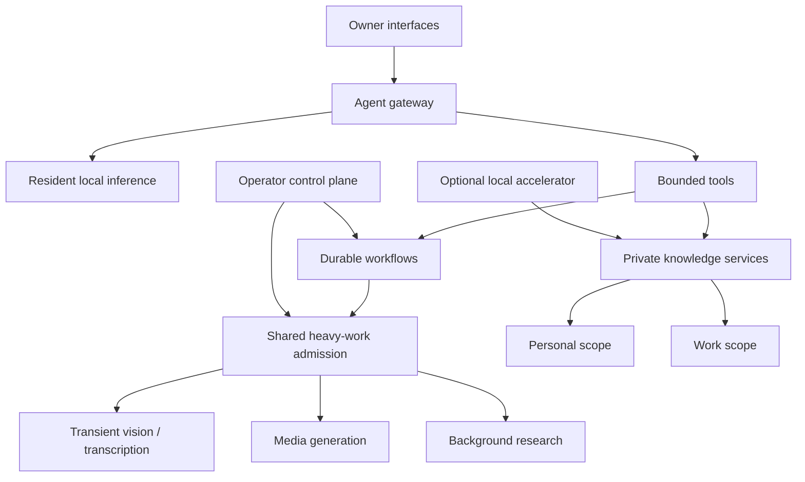

# Architecture

## Design objective

The workstation had to behave like a small local AI platform rather than a collection
of unrelated demos. Conversation, coding, retrieval, transcription, vision, image/video
generation, and scheduled research all share one memory pool. The architecture therefore
prioritizes isolation, admission control, and truthful state over maximum simultaneous use.

## Trust boundaries

### Local inference boundary

Language, vision, transcription, embeddings, and generation run on the workstation.
The design has no cloud-model fallback. External services may supply public source
metadata when a workflow explicitly needs it, but private prompts and retrieved evidence
do not leave the machine for inference.

### Filesystem boundary

The conversational agent runs with explicit mounts instead of unrestricted access to the
owner's home directory. Read-only documentation and narrowly scoped exchange locations
are separate. Private and work knowledge are structurally filtered into different
collections rather than separated only by instructions to the model.

### Resource boundary

Large models, transcription, rendering, and background analysis can each consume a
material share of unified memory. A shared admission mechanism and operating modes decide
which class of work may start. Background work yields at safe checkpoints; foreground
work is not expected to negotiate politely with an already-overcommitted GPU.

Interactive inference also has a narrower request-only admission dimension in addition
to shared-GPU accounting. Its ceiling preserves sufficient shared capacity for the
Knowledge background reserve and a safety margin even when every interactive lease is
quarantined. This isolates
fail-closed admission debt without weakening quarantine or overriding intentionally
exclusive workloads.

For protected chat, the front door also owns an exact backend request identity and
observes downstream liveness while waiting for upstream headers or chunks. A private,
authenticated control can cancel only that identity. Shared admission is released only
after the backend proves the request existed and is now absent; uncertainty remains
quarantined.

### Optional accelerator boundary

Dedicated Personal Knowledge workers may use a fixed local relay for vision, OCR,
language, and embedding. Both resolved Personal scope and dedicated-worker identity are
required. Private work scopes remain on the primary workstation. Remote embeddings are
fully validated before the primary machine may create, delete, or update semantic-index
points, and remote failure does not trigger an implicit second-device fallback.

Coordinated startup uses a stopped, request-bound preflight while both structural pause
walls remain. The primary queue controller consumes only that fresh receipt, commits the
accelerator, then requires both terminal queue progress and observed relay work before it
reports success. Master Pause restores both walls before verified remote shutdown.

## Major subsystems

### Agent and resident inference

A gateway provides conversation and tool use through a stable logical model identity.
The physical serving implementation can change behind that identity only after an
evaluation and rollback plan. Lightweight health probes use status endpoints without
consuming inference capacity. Separate bounded functional canaries verify that a healthy
service can actually generate a valid response.

### Private knowledge

Documents and images move through local extraction, OCR/vision where needed, embeddings,
and scoped retrieval. Evidence is retrieved before answer generation, citations are
validated independently, and an empty evidence set produces a refusal instead of a
plausible invention.

### Durable background workflows

Research, media, and ingestion pipelines persist intent, progress, terminal state, and
delivery outcome. `Queued`, `running`, `completed`, `delivered`, and `suppressed` are
different states. Interrupted work resumes from checkpoints or requeues safely instead of
assuming success from a launcher exit code.

### Operator control plane

The control plane exposes health, workload modes, queues, and narrowly allowlisted
actions. Destructive-adjacent actions require explicit confirmation and recoverable
staging. The browser does not receive a general shell or arbitrary filesystem API.

## Architectural rules that emerged

1. Privacy must be enforced by mounts, identities, and network boundaries—not prompts.
2. One shared-memory machine needs admission control before it needs more schedulers.
3. A stable logical model name reduces downstream configuration churn during evaluations.
4. Background work must persist receipts and yield; launcher acceptance is not completion.
5. A candidate model is not promoted until it passes realistic multi-turn and tool-use
   behaviour, not just throughput or one-shot benchmarks.
6. Every activation retains a measured rollback path until the user-visible path passes.
7. Accelerator changes are retained only when fixed-window completed-work evidence beats
   the existing topology without weakening scope, pause, admission, or mutation walls.
8. Shared capacity needs per-profile debt ceilings; a correct fail-closed lease must not
   be able to starve an unrelated background workflow indefinitely.
9. Client EOF triggers cancellation but does not prove it; exact backend absence is the
   evidence required to release protected capacity.
